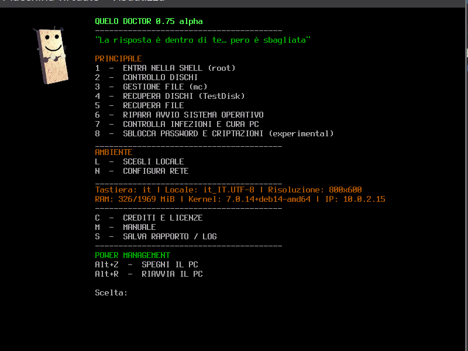

<p align="center">
  
</p>

<h1 align="center">Quelo Doctor</h1>

<p align="center">
  <strong>ISO live di soccorso per PC Leggera</strong> — menu testuale, diagnostica dischi, recupero dati, antivirus anche offline.<br>
  <strong>Lightweight PC rescue live ISO</strong> — text menu, disk diagnostics, data recovery, offline antivirus too.
</p>

<p align="center">
  <a href="https://github.com/alby-quelo/quelo-doctor/releases/latest"></a>
  
  
  
</p>

<p align="center">
  <a href="https://alby-quelo.github.io/quelo-doctor/">Sito web / Website</a> ·
  <a href="#usb-requisiti">USB e requisiti</a> ·
  <a href="#download">Download</a> ·
  <a href="#italiano">Italiano</a> ·
  <a href="#english">English</a> ·
  <a href="#build">Build</a> ·
  <a href="#segnalare-problemi">Segnalazioni</a> ·
  <a href="#avvertenza">Avvertenza</a>
</p>

---

<a id="usb-requisiti"></a>
## Chiavetta USB e requisiti / USB stick & requirements

**Quelo Doctor** è pensata per girare da **chiavetta USB** (o da qualsiasi supporto avviabile): scarichi l'ISO dalle Releases, la copi sul supporto con **il metodo che preferisci** e avvii il PC da lì.

**Metodi comuni per preparare la USB** (tutti validi):

| Metodo | Note |
|--------|------|
| **[Ventoy](https://www.ventoy.net/)** | Copi il file `.iso` sulla chiavetta già preparata con Ventoy — niente riscrittura ogni volta |
| **`dd`** | Scrittura raw bit-per-bit (`dd if=quelo-doctor-….iso of=/dev/sdX …`) — classico su Linux |
| **Rufus / balenaEtcher** | GUI su Windows, macOS o Linux — selezioni l'ISO e il dispositivo USB |
| **Altri tool** | Qualsiasi programma che scrive correttamente un'ISO avviabile (UEFI e/o BIOS) |

📖 **[Guida completa preparazione USB](https://alby-quelo.github.io/quelo-doctor/usb.html)** — passo passo per Ventoy, `dd`, Rufus, balenaEtcher, GNOME Disks, USBImager, Win32 Disk Imager e altri.

**Avvio:** inserisci la USB, accendi il PC, entra nel menu boot (F12, F8, Esc… a seconda del modello) e scegli la chiavetta. Funziona con **UEFI** e **Legacy BIOS**.

### Requisiti minimi del PC / Minimum PC specs

Niente desktop grafico: solo console testuale. In uso normale (menu principale) la RAM occupata resta **sotto 1 GB**; per questo gira bene anche su macchine vecchie o con poca memoria.

| Componente | Minimo | Consigliato |
|------------|--------|-------------|
| **Architettura** | **x86_64 (amd64)** — processore a 64 bit | Stesso |
| **RAM** | **512 MB** (menu e shell) | **2 GB** se usi scan antivirus (menu 7) o recupero file su dischi grandi |
| **Uso tipico menu** | ~300–800 MB RAM osservati a idle | — |
| **Processore** | Qualsiasi CPU **64 bit** amd64 (anche single-core) | Dual-core o superiore per operazioni lunghe (ClamAV, TestDisk) |
| **Chiavetta USB** | **2 GB** (ISO ~1 GB) | **4 GB+** — più comoda per aggiornamenti e copie di backup |
| **Schermo** | Console testuale / framebuffer — **nessuna GPU dedicata** richiesta | — |
| **Rete** | Opzionale (menu **N**); firmware non-free già inclusi per LAN, Wi‑Fi e mobile broadband | Utile per aggiornare firme antivirus prima dello scan |
| **Boot** | UEFI **oppure** Legacy BIOS | — |

> **Nota:** menu **7** (ClamAV + YARA) e operazioni su volumi molto grandi possono richiedere più RAM e tempo CPU; su PC con 512 MB resta usabile per diagnostica dischi, shell, mc e ripristino avvio.

---

<p align="center">
  
</p>
<p align="center"><em>Menu principale — versione 0.75 alpha / Main menu — version 0.75 alpha</em></p>

---

## Download

| File | Descrizione |
|------|-------------|
| **[quelo-doctor-0.75-alpha.iso](https://github.com/alby-quelo/quelo-doctor/releases/latest)** | Ultima ISO verificata (~1 GB) |
| **SORGENTI/** in questo repo | Sorgenti per build e personalizzazione |

> L'ISO non è nel tree git (limite 100 MB di GitHub). Si scarica dalle **Releases**.

Vedi sopra [USB e requisiti](#usb-requisiti) per preparazione chiavetta e hardware minimo.

---

<a id="italiano"></a>
## Italiano

### Cos'è Quelo Doctor

**Quelo Doctor** è una distribuzione **live** pensata per tecnici e utenti avanzati che devono **salvare un PC in emergenza**: dischi che non bootano, file cancellati, sospetta infezione, password dimenticate, avvio Windows/Linux rotto.

Niente desktop, niente browser: solo un **menu testuale** rapido su TTY, ispirato al personaggio **Quelo** di Corrado Guzzanti (crediti in menu **C**).

### Perché queste scelte

| Scelta | Motivo |
|--------|--------|
| **Menu testuale, no GUI** | Funziona su quasi tutto l'hardware, anche con GPU/driver problematici; meno RAM, avvio più prevedibile |
| **Debian sid + live-build** | Base solida, pacchetti aggiornati, toolchain standard per ISO live |
| **Un tool per voce di menu** | Flusso guidato: non devi cercare quale programma lanciare (TestDisk, mc, ClamAV…) |
| **Automount USB in /media** | Chiavette e dischi USB compaiono subito, pronti per salvare report e log |
| **Documentazione stile `man`** | Crediti, licenze e manuale (C/M) usano `man-db` + `groff` + `less`: scroll affidabile su console |
| **Tasto Q uniforme** | Indietro/uscita uguale ovunque (sottomenu e testi), come nei pager standard Linux |
| **Firmware non-free** | Inclusi (sezione `non-free-firmware` di Debian) per coprire il maggior numero di schede di rete: **Ethernet (LAN)**, **Wi‑Fi** e **mobile broadband** (modem USB/4G via ModemManager) |
| **Solo amd64** | Copre i PC reali in campo; build più snella |

### Menu principale

**PRINCIPALE**
1. Shell root  
2. Controllo dischi (SMART, partizioni, mount, fsck)  
3. Gestione file (Midnight Commander)  
4. Recupera dischi (TestDisk)  
5. Recupera file (ext/NTFS, wizard)  
6. Ripara avvio S.O. (GRUB, MBR, Windows)  
7. Controlla infezioni (ClamAV, YARA, chkrootkit)  
8. Sblocca password e criptazioni *(experimental)*  

**AMBIENTE** — `L` lingua/tastiera · `N` rete  

**INFO** — `C` crediti e licenze · `M` manuale · `S` salva rapporto/log su USB  

**POWER** — `Alt+Z` spegni · `Alt+R` riavvia  

### Software principale incluso

TestDisk/PhotoRec, Midnight Commander, ClamAV, YARA, GRUB, ntfs-3g, NetworkManager, ModemManager, smartmontools, cryptsetup/dislocker, **firmware non-free** (Intel/Realtek/Broadcom/Mediatek e schede Ethernet enterprise per LAN, Wi‑Fi e mobile broadband), e componenti Debian documentati in menu **C** / **Licenze**.

### Come funziona (in breve)

1. Boot da USB → logo e menu verde/ambra  
2. Un tasto per scegliere la voce  
3. **Q** per tornare indietro  
4. I report (menu **S** e log scan menu **7**) si salvano su supporti esterni con permessi leggibili da desktop (`644`, utente `1000`)  

### Build dalla sorgente

Requisiti: Debian/Ubuntu, `sudo`, `live-build`, `debootstrap`, spazio ~15 GB.

```bash
git clone https://github.com/alby-quelo/quelo-doctor.git
cd quelo-doctor/SORGENTI
sudo ./build.sh
```

L'ISO finisce in `../ISO/quelo-doctor-X.XX-alpha.iso`. Versione corrente in `SORGENTI/VERSION`.

Personalizza overlay in `SORGENTI/overlay/`, pacchetti in `SORGENTI/packages/extra.list.chroot`, hook in `SORGENTI/hooks/`.

---

<a id="english"></a>
## English

### What is Quelo Doctor

**Quelo Doctor** is a **live** rescue ISO for technicians and power users: broken boot, deleted files, malware checks, password recovery, Windows/Linux boot repair.

No desktop, no web browser: a fast **text menu** on the Linux console, named after the **Quelo** character by Corrado Guzzanti (see menu **C** for credits).

### Why we built it this way

| Choice | Reason |
|--------|--------|
| **Text menu, no GUI** | Works on difficult hardware; lower RAM use; predictable boot |
| **Debian sid + live-build** | Solid base, current packages, standard live ISO tooling |
| **One guided tool per menu item** | No guessing which app to run (TestDisk, mc, ClamAV…) |
| **USB automount under /media** | External drives ready for reports and logs |
| **`man`-style docs** | Credits, licenses, manual (C/M) via `man-db` + `groff` + `less` |
| **Uniform Q key** | Back/exit everywhere, consistent with standard Linux pagers |
| **Non-free firmware** | Included (Debian `non-free-firmware`) to support as many network adapters as possible: **Ethernet (LAN)**, **Wi‑Fi**, and **mobile broadband** (USB modems/4G via ModemManager) |
| **amd64 only** | Matches real-world hardware; leaner build |

### Main menu

See Italian section above — same layout. Menu **L** switches locale (Italian/English).

### Rebuild your own

```bash
git clone https://github.com/alby-quelo/quelo-doctor.git
cd quelo-doctor/SORGENTI
sudo ./build.sh
```

Edit `SORGENTI/overlay/` for scripts and config, `packages/extra.list.chroot` for packages.

---

<a id="build"></a>
## Struttura repository / Repository layout

```
quelo-doctor/
├── README.md           ← questa pagina
├── docs/               ← sito GitHub Pages
├── images/             ← screenshot e mascotte
├── SORGENTI/           ← sorgenti build (overlay, hooks, build.sh)
└── ISO/                ← (solo locale) — su GitHub usa Releases
```

---

<a id="segnalare-problemi"></a>
## Segnalare problemi / Report issues

Hai trovato un bug? Apri una **[Issue](https://github.com/alby-quelo/quelo-doctor/issues/new/choose)** con:

- versione ISO (es. 0.75)  
- passi per riprodurre  
- hardware (UEFI/BIOS, dischi)  
- comportamento atteso vs osservato  

Found a bug? Open an **[Issue](https://github.com/alby-quelo/quelo-doctor/issues/new/choose)** with the same details.

---

<a id="avvertenza"></a>
## Avvertenza / Disclaimer

> **Avvertenza.** Quelo Doctor è distribuito «così com'è», senza garanzie di alcun tipo, espresse o implicite. È realizzato a **scopo didattico e sperimentale**: non sostituisce l'assistenza professionale né garantisce il recupero dei dati o l'esito delle operazioni su dischi, sistemi o reti. L'uso è a proprio rischio; gli autori non rispondono di danni diretti o indiretti derivanti dall'uso dell'ISO o delle istruzioni pubblicate.

> **Disclaimer.** Quelo Doctor is provided «as is», without warranty of any kind, express or implied. It is intended for **educational and experimental purposes** only: it does not replace professional support and does not guarantee data recovery or the outcome of any disk, system, or network operation. Use at your own risk; the authors are not liable for any direct or indirect damage arising from the use of the ISO or the published instructions.

---

## Licenze / Licenses

- **Quelo Doctor** (menu, script, overlay): [CC BY-NC 4.0](https://creativecommons.org/licenses/by-nc/4.0/) — vedi `SORGENTI/overlay/.../licenses.*.txt`  
- **Software di terze parti**: GPL, Apache, ecc. — elenco completo in ISO menu **C** → Licenze  

---

<p align="center">
  <sub>Quelo Doctor — alpha · Ultima verificata / Last verified: <strong>0.75</strong></sub>
</p>
